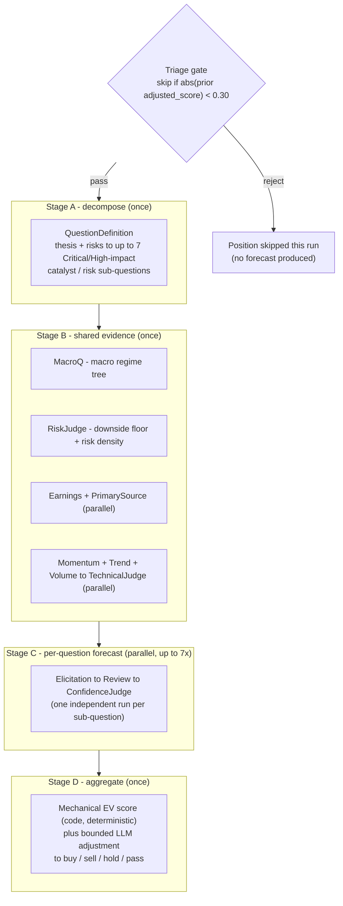

# investment-forecaster

[](https://github.com/James-Kupfer/investment-forecaster/actions/workflows/ci.yml)

A multi-agent LLM pipeline that applies [Philip Tetlock's superforecaster discipline](https://en.wikipedia.org/wiki/Superforecasting) to investment positions: decompose a thesis into narrow, independently-checkable predictions, forecast each one with explicit reasoning (reference class → inside view → pre-mortem), grade the reasoning, and only then let the numbers drive a buy/sell/hold/pass call. Every probability is scored against reality later via [Brier scoring](https://en.wikipedia.org/wiki/Brier_score), and that scoring feeds back into which agents/models get trusted more over time.

This is a personal research tool, not investment advice, and it is not a fully-automated trading system — it produces a calibrated, documented opinion for a human to weigh alongside everything else they know.

> **Docs map:** this README explains *what the system does and how to run it*. [`architecture.md`](architecture.md) is the deep reference — full database schema, every agent's inputs/outputs, and module-by-module function reference. [`CLAUDE.md`](CLAUDE.md) is operating instructions for AI coding assistants working in this repo (conventions, gotchas, non-obvious rules) — not required reading to use the project.

---

## How it works

For each position, the pipeline decomposes the investment thesis into a handful of narrow yes/no sub-questions, gathers shared evidence once, forecasts each sub-question independently, and mechanically aggregates the results into a recommendation:



Long/short is **never** decided upstream — `question_definition` only tags each sub-question as a catalyst (positive if it resolves YES) or a risk (negative if it resolves YES). The buy/sell/hold/pass call is derived downstream, purely from the net weighted expected value of all sub-question outcomes.

### Triage: the gate before spending any money

Running the full pipeline costs real API spend across roughly a dozen LLM calls per position. Triage is a **free, no-LLM pre-check** (`forecaster/agents/triage.py`) that decides whether a position is worth re-forecasting at all before any of that spend happens:

- **The boundary is a fixed constant**, `TriageAgent.THRESHOLD = 0.30`, hardcoded in `forecaster/agents/triage.py`. It is not learned, not configurable at runtime, and does not move based on market conditions, position size, or anything else — it only changes if a human edits that line and ships the change. (This is a different thing from the buy/sell *recommendation* thresholds in `aggregation.py`, which *do* shift per forecast based on asymmetric-return rating and how many sub-questions scored — see [`architecture.md`](architecture.md#aggregation--from-score-to-recommendation). Triage's threshold is static; aggregation's are dynamic.)
- **What it gates on:** the magnitude of the position's most recent `adjusted_score` (the final, LLM-adjusted expected-value score from the last completed pipeline run for that symbol — see `forecasts.adjusted_score`). Magnitude, not sign: a strongly-negative prior score is just as worth re-forecasting as a strongly-positive one. A score near zero means the last run genuinely couldn't find much signal, and re-running immediately is unlikely to change that.
- **A symbol's first-ever run always passes** (no prior `adjusted_score` to gate on).
- **Below 0.30, the position is skipped** — the pipeline returns without inserting a `forecasts` row and without making any LLM calls for that run.

**Does a skipped position ever get re-forecast automatically? No — by design.** A triage rejection doesn't write anything to the database, so the "most recent `adjusted_score`" that the *next* scheduled run will see is the same value as before, and the position is skipped again. That's what keeps the scheduled/batch job (`scripts/run_forecasts.py` with no `--symbol`) cheap: it never spends a dozen LLM calls re-litigating a position that already came back near-zero conviction, and it deliberately refuses to bypass triage in bulk (`--force` errors out unless paired with `--symbol`), so nothing can silently rack up spend re-forecasting a whole portfolio of low-conviction positions.

The lever this puts in your hands: **`--force` is how you trigger a deliberate "has the thesis changed?" refresh** for one specific position, on your own schedule, independent of triage — after news breaks, ahead of an earnings print, or just as a periodic check-in to confirm the original thesis still holds:

```bash
python scripts/run_forecasts.py --symbol AAPL --force
```

(`run_pipeline.ps1`'s interactive prompt offers the same override, and disables it if you choose to run the whole portfolio rather than a single symbol — so a periodic refresh is always a deliberate, per-symbol decision, never something that silently applies across the board.)

### Sub-question forecasting

Each sub-question that survives decomposition runs through three steps, independently of every other sub-question:

1. **Elicitation** — a Tetlock-style four-step estimate: reference class → inside view → pre-mortem → synthesized probability.
2. **Review** — a devil's-advocate pass checking for confirmation bias, overconfidence, anchoring, base-rate neglect, and narrative fallacy, scoped to that one sub-question. May revise the probability.
3. **Confidence Judge** — shrinkage toward the outside view when inside/outside estimates diverge, plus a confidence interval and a `final_probability`.

### Aggregation: from score to recommendation

`aggregation.py` computes a **mechanical expected-value score deterministically in code** — the LLM never sets this number directly. Each sub-question contributes `final_probability × severity_weight` (Critical=4, High=3) to either the upside or downside side of the ledger depending on whether it's a catalyst or a risk; the mechanical score is the normalized net of the two sides. The LLM's role is bounded to three things: grading each sub-question's rationale quality, proposing a capped ±0.30 adjustment to the mechanical score with a logged reason, and choosing the final buy/sell/hold/pass label. Both the mechanical score and the LLM's adjustment are stored separately (`mechanical_score` vs `adjusted_score`) so later calibration review can tell which one was actually right.

Two mechanical adjustments widen or narrow the buy/sell thresholds *before* the LLM sees them — see [`architecture.md`](architecture.md#aggregation--from-score-to-recommendation) for the exact formulas:

- **Risk/reward asymmetry** — a moonshot-rated position (`asymmetric_rating = High`) gets more room before triggering a sell on one bad print, since the payoff shape justifies more risk tolerance.
- **Thin decompositions** — a position with only 1–3 scorable sub-questions has its score mathematically pinned toward ±1 (a single question's probability can't affect anything but which side it lands on), so the thresholds widen toward `hold` as the question count drops, tapering to zero once there are 4+ scored questions.

### Resolution: what gets auto-checked, and what doesn't

`run_resolution.py` runs after a sub-question's `resolution_date` passes. Sub-questions with `resolution_source = price` (a specific price level) resolve automatically against real historical prices. Sub-questions anchored to a specific reported number (`resolution_source = filing` — an actual EPS beat, a guidance figure, an insider-buying threshold) forecast *more* accurately than a generic price bet, precisely because they're concrete — but they can't be auto-resolved from a price feed. Those are logged as "needs manual resolution," not silently skipped or guessed at. There's currently no UI or script that closes that loop for you; resolving a filing-anchored question means reading the filing and updating the row by hand.

---

## Getting started

### Prerequisites

- Python 3.10+
- PostgreSQL, reachable at `localhost:5432` by default
- An Anthropic API key
- A SEC EDGAR-compliant User-Agent string (a real contact email — see [SEC's fair-access policy](https://www.sec.gov/os/webmaster-faq#developers))
- Optional: [TA-Lib](https://github.com/cgohlke/talib-build/releases) (native library) for technical-indicator calculations; the pipeline falls back to pandas-based approximations if it isn't installed
- Optional: an IBKR Client Portal Gateway running locally, for live OHLCV price data (falls back to a direct Yahoo Finance chart-API call if unavailable)

### Configuration

**TOML is the first choice for configuring this project.** Copy [`config.example.toml`](config.example.toml) to `config.toml` at the repo root (git-ignored — never committed) and edit it for your machine:

```toml
[secrets]
# Folder containing postgres.py, Anthropic.py, and SEC.py (see "Credentials" below).
# A single string or a list of strings both work.
override = "C:/Users/you/Secrets"

[database]
port = 5432
name = "investment_forecaster"
portfolio_db_name = "investment_portfolio"

[market_data]
ibkr_gateway_url = "https://localhost:5000"
```

Real OS environment variables (`DB_PORT`, `DB_NAME`, `PORTFOLIO_DB_NAME`, `IBKR_GATEWAY_URL`, `FORECASTER_SECRETS_DIR`) still override individual `config.toml` values when set — see [`.env.example`](.env.example) — which is what the self-hosted CI runner uses instead of relying on a checked-out file (its working directory gets `git clean`ed between runs, so a git-ignored `config.toml` there wouldn't persist).

### Credentials

This project does **not** use a `.env` file for secrets, and secret *values* never go in `config.toml` either — only the *path* to where they live. `forecaster/credentials.py` loads `ANTHROPIC_API_KEY`, `DB_USER`/`DB_PASSWORD`, and `SEC_EDGAR_USER_AGENT` directly from Python files in the folder `config.toml`'s `[secrets] override` points to, so the same credentials can be shared across sibling repos without duplicating them. If you're setting this up fresh (including as a fork), create:

```
Secrets/
├── postgres.py      # postgres_user, postgres_password, dsn
├── Anthropic.py      # ANTHROPIC_API_KEY = "sk-ant-..."
└── SEC.py            # SEC_EDGAR_USER_AGENT = "Your Name your@email.com"
```

and point `config.toml`'s `[secrets] override` at that folder.

**Windows only:** set `PYTHONUTF8=1` as a real OS environment variable (`setx PYTHONUTF8 1`, then open a new shell) before running anything that calls the Anthropic API. Without it, Windows' default `cp1252` locale silently mangles non-ASCII characters (em-dashes, smart quotes) in LLM output before it's ever written to the database — the corruption is permanent, not just a display glitch. Verify with:

```bash
python -c "import locale; print(locale.getpreferredencoding())"
# must print: utf-8
```

### Install

```bash
pip install -r requirements.txt
```

### Set up the database

```bash
psql -U <user> -h localhost -c "CREATE DATABASE investment_forecaster;"
python scripts/run_migrations.py       # idempotent -- safe to re-run
python scripts/seed_prompt_registry.py # seeds personas/*.md into prompt_registry
```

(On Windows, `setup/setup.ps1` scripts steps 1–5 of the above, including database creation, for a machine that already has the `Secrets` folder in place. `scripts/run_pipeline.ps1` — or just double-click `run_pipeline.bat` at the repo root — is an interactive launcher for day-to-day use once setup is done.)

This app's own schema lives in `investment_forecaster`. It separately reads (never writes) a `positions` table from a companion `investment_portfolio` database — owned by a sibling repo, `investment-portfolio-manager` — for thesis text, risk ratings, and thresholds. If you're running this standalone, you'll need your own `positions` table matching the columns `forecaster/pipeline.py`'s `_get_position_context()` selects, or a stub of that sibling repo.

### Run a forecast

```bash
python scripts/run_forecasts.py --symbol AAPL           # one position
python scripts/run_forecasts.py                         # every active position (triage-gated)
python scripts/run_forecasts.py --symbol AAPL --force    # bypass the triage gate for this symbol
python scripts/run_macroq.py                             # macro regime snapshot only (no position needed)
python scripts/run_resolution.py                         # resolve past-due forecasts, score, update agent_weights
```

---

## Database

PostgreSQL, two databases: `investment_forecaster` (this app — prompts, forecasts, sub-questions, LLM call log, agent accuracy weights) and `investment_portfolio` (read-only from here — position theses and risk ratings). Full column-level schema is in [`architecture.md`](architecture.md#database).

---

## Project layout

```
investment-forecaster/
├── forecaster/
│   ├── agents/                 # One class per pipeline agent (see architecture.md)
│   │   ├── research/           # Earnings, PrimarySource (SEC EDGAR-backed)
│   │   └── technical/          # Momentum, Trend, Volume, TechnicalJudge
│   ├── pipeline.py             # ForecastPipeline -- orchestrates the 4 stages
│   ├── db.py                   # DB connection + dynamic column-update helpers
│   ├── edgar_client.py         # SEC EDGAR client (filings, XBRL financials, Form 4)
│   ├── market_data.py          # OHLCV fetch: IBKR cache -> IBKR Gateway -> Yahoo
│   ├── talib_preprocess.py     # OHLCV -> plain-English technical descriptions
│   ├── credentials.py          # Loads secrets from the shared Secrets folder
│   ├── config.py               # Loads config.toml -- secrets-folder path + non-secret settings
│   └── utils.py                # extract_json() -- robust LLM JSON extraction
├── personas/                    # One .md prompt file per agent (source of truth)
│   └── model_config.py          # AGENT_MODELS -- sole owner of agent->model mapping
├── migrations/                  # NNN_description.sql, applied in order, idempotent
├── scripts/                     # CLI entry points (see "Getting started" above)
│   └── run_pipeline.ps1         # Interactive launcher -- Excel sync, symbol, force, all in one prompt
├── setup/                       # Windows setup/CI-runner-install scripts
├── tests/                       # pytest -- mocked-API unit tests + live-DB integration tests
├── run_pipeline.bat              # Double-click wrapper for scripts/run_pipeline.ps1
├── config.example.toml           # Config template -- copy to config.toml (git-ignored) and edit
├── architecture.md               # Full schema / agent / module reference
└── CLAUDE.md                     # AI coding assistant operating instructions
```

## Testing

```bash
python -m pytest --ignore=tests/test_db.py   # unit tests -- mocked Anthropic API, no DB needed
python -m pytest tests/test_db.py            # live-DB integration test -- needs a real Postgres instance
```

CI (`.github/workflows/ci.yml`) runs on a self-hosted runner and always excludes `test_db.py`.

## Contributing

See [`CLAUDE.md`](CLAUDE.md) for the conventions this codebase follows (agent structure, prompt-registry versioning, migration rules, token-budget gotchas) — they apply to human contributors too, not just AI assistants. Prompts are database rows, not code: edit the relevant `personas/<agent>.md` file, then run `python scripts/update_prompt.py --agent <agent_id> --version <vX.Y>` rather than editing `prompt_registry` directly.

## Known limitations

- **Filing-anchored sub-questions require manual resolution** — no script closes that loop today; `run_resolution.py` only logs which ones need attention.
- **Coupled to a private sibling repo** (`investment-portfolio-manager`) for position data — see [Set up the database](#set-up-the-database).
- No `LICENSE` file yet.

## License

Not yet licensed — all rights reserved by default until a license is added. Ask before reusing.
